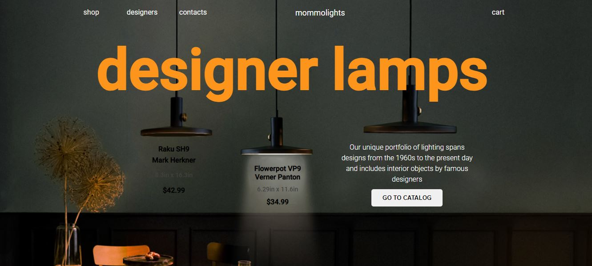
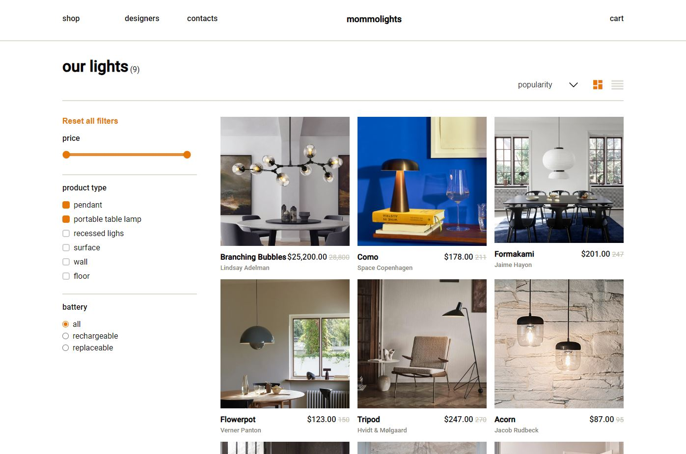
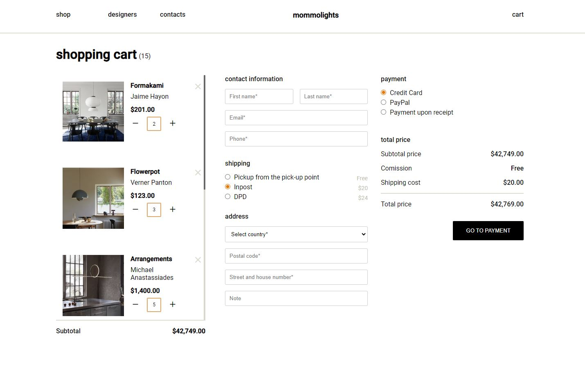

# LampECommerce

Lamp e-commerce store is a final Angular project for Boolean Bootcamp. The idea for the project was born from my education as a lighting designer and love for designer lamps. I took inspiration of [this](https://www.behance.net/gallery/160900875/Mommolights-Website-EcommerceLamps) beautiful UI design by Katerina Mikhaylova(@mmetrin).

## Database structure

```json
{
    "name": "Branching Bubbles",
    "manufacturer": "Lindsey Adelman Studio",
    "price": 25200,
    "prevPrice": 28800,
    "designer": "Lindsay Adelman",
    "image": "https://live.staticflickr.com/65535/53101113527_7b1e277e0f_o.jpg",
    "id": "01",
    "category": "pendant",
    "dimensions": "L 80in x W 25in x H 21in",
    "colourTemperature": "2700K",
    "lightOutput": "1200lm",
    "CRI": ">85",
    "lifeTime": 25000,
    "voltage": "5.0V, 1A",
  },

```

## Domain models

```
Item {
  name: string;
  manufacturer: string;
  price: number;
  prevPrice?: number;
  designer: string;
  image: string;
  id: string;
  category?: string;
  dimensions?: string;
  colourTemperature?: string;
  lightOutput?: string;
  CRI?: string;
  lifeTime?: number;
  voltage?: string
}

CartItem {
  item: Item;
  quantity: number;
}

```

## User scenarios

```
1. User can view bestsellers products.
2. User can viw sale collection.
3. User can view product description.
4. User can add products to cart.
5. User can add multiple products to cart.
6. User can view cart.
7. User can adjust the quantity in cart
8. User can see the total and subtotal cost.
9. User can remove products from cart.
10. User can fill the form with shipping information.
11. Address form section disappears when pick-up point is selected.
12. User can see incorrectly filled fields and error messages.

```

## Development server

Run `ng serve` for a dev server. Navigate to `http://localhost:4200/`. The application will automatically reload if you change any of the source files.
Run `node server.js` to run server with json data on port 3000.

## Build

Run `ng build` to build the project. The build artifacts will be stored in the `dist/` directory.

## Screenshots

- Home page



- Shop page



- Cart page


